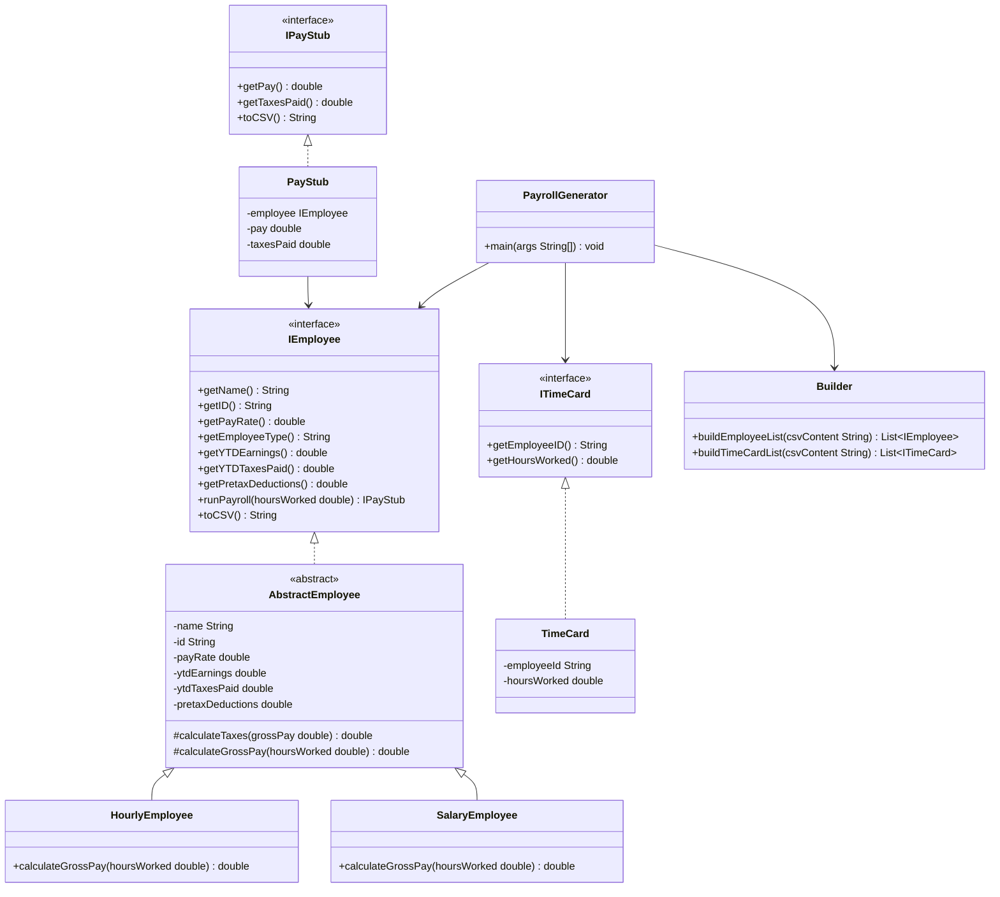

# Payroll Generator Design Document


This document is meant to provide a tool for you to demonstrate the design process. You need to work on this before you code, and after have a finished product. That way you can compare the changes, and changes in design are normal as you work through a project. It is contrary to popular belief, but we are not perfect our first attempt. We need to iterate on our designs to make them better. This document is a tool to help you do that.


## (INITIAL DESIGN): Class Diagram

Place your class diagram below. Make sure you check the fil in the browser on github.com to make sure it is rendering correctly. If it is not, you will need to fix it. As a reminder, here is a link to tools that can help you create a class diagram: [Class Resources: Class Design Tools](https://github.com/CS5004-khoury-lionelle/Resources?tab=readme-ov-file#uml-design-tools)



## (INITIAL DESIGN): Tests to Write - Brainstorm

Write a test (in english) that you can picture for the class diagram you have created. This is the brainstorming stage in the TDD process. 

> [!TIP]
> As a reminder, this is the TDD process we are following:
> 1. Figure out a number of tests by brainstorming (this step)
> 2. Write **one** test
> 3. Write **just enough** code to make that test pass
> 4. Refactor/update  as you go along
> 5. Repeat steps 2-4 until you have all the tests passing/fully built program

You should feel free to number your brainstorm.
1. Test that the `Employee` class properly returns `name` from `getName()`
2. Test that the `Employee` class properly returns `id` from `getId()`
3. Test that HourlyEmployee returns correct employee type ("HOURLY")
4. Test that SalaryEmployee returns correct employee type ("SALARY")
5. Test that HourlyEmployee calculates regular pay correctly (hours <= 40)
6. Test that HourlyEmployee calculates overtime pay correctly (hours > 40)
7. Test that SalaryEmployee calculates pay correctly (annual salary / 24)
8. Test that SalaryEmployee returns 0 pay when hours worked is 0
9. Test negative hours worked returns null PayStub
10. Test zero hours worked produces valid PayStub with zero pay
11. Test extremely large numbers don't cause overflow issues
12. Test decimal precision is maintained (2 decimal places)
13. Test PayStub CSV output format is correct
14. Test PayStub returns correct pay amount via getPay()
15. Test PayStub returns correct taxes via getTaxesPaid()
16. Test Builder can create HourlyEmployee from CSV string
17. Test Builder can create SalaryEmployee from CSV string
18. Test Builder can create TimeCard from CSV string


## (FINAL DESIGN): Class Diagram

Go through your completed code, and update your class diagram to reflect the final design. Make sure you check the file in the browser on github.com to make sure it is rendering correctly. It is normal that the two diagrams don't match! Rarely (though possible) is your initial design perfect. 

> [!WARNING]
> If you resubmit your assignment for manual grading, this is a section that often needs updating. You should double check with every resubmit to make sure it is up to date.
```mermaid
classDiagram
    class PayrollGenerator {
        <<utility>>
        -DEFAULT_EMPLOYEE_FILE String$
        -DEFAULT_PAYROLL_FILE String$
        -DEFAULT_TIME_CARD_FILE String$
        +main(args String[]) void$
    }

    class Arguments {
        -employeeFile String
        -payrollFile String
        -timeCards String
        +getEmployeeFile() String
        +getPayrollFile() String
        +getTimeCards() String
        +printHelp() void
        +process(args String[]) Arguments$
    }

    class IEmployee {
        <<interface>>
        +getName() String
        +getID() String
        +getPayRate() double
        +getEmployeeType() String
        +getYTDEarnings() double
        +getYTDTaxesPaid() double
        +getPretaxDeductions() double
        +runPayroll(hoursWorked double) IPayStub
        +toCSV() String
    }

    class AbstractEmployee {
        <<abstract>>
        -name String
        -id String
        -payRate double
        -ytdEarnings double
        -ytdTaxesPaid double
        -pretaxDeductions double
        #TAX_RATE double
        #OVERTIME_RATE double
        #REGULAR_HOURS int
        #SALARY_PAY_PERIODS int
        +getName() String
        +getID() String
        +getPayRate() double
        +getYTDEarnings() double
        +getYTDTaxesPaid() double
        +getPretaxDeductions() double
        +runPayroll(hoursWorked double) PayStub
        #calculateGrossPay(hoursWorked double)* double
        +toCSV() String
    }

    class HourlyEmployee {
        -grossPay double
        +getEmployeeType() String
        #calculateGrossPay(hoursWorked double) double
    }

    class SalaryEmployee {
        -grossPay double
        +getEmployeeType() String
        #calculateGrossPay(hoursWorked double) double
    }

    class IPayStub {
        <<interface>>
        +getPay() double
        +getTaxesPaid() double
        +toCSV() String
    }

    class PayStub {
        -name String
        -netPay double
        -taxes double
        -ytdEarnings double
        -ytdTaxesPaid double
        +getPay() double
        +getTaxesPaid() double
        +toCSV() String
        -trimTrailingZero(number double) String
    }

    class ITimeCard {
        <<interface>>
        +getEmployeeID() String
        +getHoursWorked() double
    }

    class TimeCard {
        -id String
        -hoursWorked double
        +getEmployeeID() String
        +getHoursWorked() double
    }

    class Builder {
        <<utility>>
        +buildEmployeeFromCSV(csv String) IEmployee$
        +buildTimeCardFromCSV(csv String) ITimeCard$
    }

    class FileUtil {
        <<utility>>
        +EMPLOYEE_HEADER String$
        +PAY_STUB_HEADER String$
        +readFileToList(file String) List~String~$
        +writeFile(outFile String, lines List~String~) void$
        +writeFile(outFile String, lines List~String~, backup boolean) void$
    }

    class EmployeeType {
        <<enumeration>>
        HOURLY
        SALARY
    }

    IEmployee <|.. AbstractEmployee
    AbstractEmployee <|-- HourlyEmployee
    AbstractEmployee <|-- SalaryEmployee
    IPayStub <|.. PayStub
    ITimeCard <|.. TimeCard
    AbstractEmployee --> PayStub
    AbstractEmployee ..> EmployeeType
    PayrollGenerator ..> FileUtil
    PayrollGenerator ..> Builder
    PayrollGenerator ..> IEmployee
    PayrollGenerator ..> ITimeCard
    PayrollGenerator ..> IPayStub
    PayrollGenerator *-- Arguments
   ```


## (FINAL DESIGN): Reflection/Retrospective

> [!IMPORTANT]
> The value of reflective writing has been highly researched and documented within computer science, from learning new information to showing higher salaries in the workplace. For this next part, we encourage you to take time, and truly focus on your retrospective.

Take time to reflect on how your design has changed. Write in *prose* (i.e. do not bullet point your answers - it matters in how our brain processes the information). Make sure to include what were some major changes, and why you made them. What did you learn from this process? What would you do differently next time? What was the most challenging part of this process? For most students, it will be a paragraph or two.
In this project, my biggest design change was moving the PayStub processing from specific employee classes (HourlyEmployee and SalaryEmployee) to the AbstractEmployee abstract class. This change effectively reduced code duplication between hourly and salaried employee classes. Through this process, I learned how to identify common features and elevate them to a higher level in the inheritance hierarchy to achieve code reuse.

I was particularly impressed by the template method pattern used in AbstractEmployee: the parent class's runPayroll method calls the abstract calculateGrossPay method, which is implemented in the child classes. This design pattern allows us to define the framework of an algorithm in the parent class while deferring the implementation of specific steps to child classes. This not only makes the code easier to maintain but also embodies the "Open-Closed Principle" - open for extension but closed for modification.

If I were to do a similar project again, I would more carefully analyze the common behaviors and differences between classes and plan the application of template methods in advance. The most challenging part of the project was understanding the relationships between different classes and handling numerical precision issues. Regarding precision issues, I feel there are some limitations in CSV file processing, and it might be better if these restrictions could be relaxed or if clearer guidance on precision handling were provided.